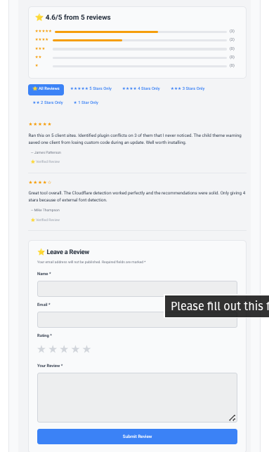

<h1 align="center">UXNitro Fast Reviews</h1>

<h2 align="center">⚡ Lightweight Review System Built for Performance</h2>

  

Plugin Version: 2.6
Author: UXNitro
Description: High-performance, lightweight review system with star ratings, filtering, and minimal database overhead.

<h2>Installation</h2>
<ol>
  <li>Download the plugin <code>.zip</code> file.</li>
  <li>Go to your WordPress Dashboard → <strong>Plugins → Add New → Upload Plugin</strong>.</li>
  <li>Upload the <code>.zip</code> file and click <strong>Install Now</strong>.</li>
  <li>Click <strong>Activate Plugin</strong>.</li>
  <li>Add reviews anywhere using the shortcode: 
    <code>[ux_reviews_compact limit="10"]</code>
    
<em>Note:</em> <code>limit</code> sets the number of reviews shown initially (default: 10).

  </li>
  <li>Optional: Use the <strong>UXNitro Soul Plugin</strong> for automatic page-level optimization.  
      If you use Soul, you don’t need to manually disable the plugin on unused pages — Soul handles it automatically.
  </li>
</ol>

<h2>Using the Plugin</h2>
<ul>
  <li>A leave a review form appears automatically below the review list.</li>
  <li>Submitted reviews are <strong>pending moderation</strong> by default.</li>
  <li>Admin can approve reviews via <strong>Dashboard → Comments</strong>.</li>
  <li>Rating stats appear at the top of the review block.</li>
  <li>Users can filter reviews by 1–5 stars dynamically (no page reload, pure JS).</li>
</ul>

<h2>Optimizing for Performance</h2>

To keep your site fast:

<ul>
  <li><strong>Load reviews only on necessary pages:</strong>
    <ul>
      <li>If not using Soul, add the shortcode only where reviews are required.</li>
      <li>Avoid placing <code>[ux_reviews_compact]</code> in global templates unless needed.</li>
    </ul>
  </li>
  <li><strong>Remove unused comment data:</strong>
    <ul>
      <li>Disable WordPress comments on pages that won’t have reviews:</li>
      <li>Edit the page in Gutenberg, Elementor, or your block builder.</li>
      <li>In <strong>Discussion Settings</strong>, uncheck <strong>Allow Comments</strong>.</li>
    </ul>
  </li>
  <li><strong>Lazy-load reviews if needed:</strong>
    <ul>
      <li>Reviews are compact by default and loaded inline.</li>
      <li>For large numbers of reviews, consider lazy-loading via a plugin or custom code.</li>
    </ul>
  </li>
  <li><strong>Minimize CSS/JS:</strong>
    <ul>
      <li>The plugin loads minimal CSS/JS inline.</li>
      <li>For extra optimization, move CSS/JS to your theme for caching.</li>
    </ul>
  </li>
</ul>

<h2>Admin Tips</h2>
<ul>
  <li>View pending reviews under <strong>Comments → All Comments</strong>.</li>
  <li>Ratings appear as stars (★) in the admin column.</li>
  <li>Filter reviews by star rating using the drop-down in the admin.</li>
  <li>Approved reviews appear automatically on the front-end.</li>
</ul>

<h2>Troubleshooting</h2>
<ul>
  <li><strong>Form not submitting?</strong> Check that <code>wp_mail()</code> works on your server (used for admin notifications).</li>
  <li><strong>Review block not showing?</strong> Make sure the shortcode is placed inside the main content area or a compatible block.</li>
  <li><strong>Performance issues?</strong> Only place the shortcode on pages that need reviews, or use the Soul plugin for automatic page-level optimization.</li>
</ul>

<h2>Best Practices</h2>
<ul>
  <li>Keep the plugin active only where needed.</li>
  <li>Disable WordPress comments on pages without reviews.</li>
  <li>Use caching and optimization plugins for large sites.</li>
  <li>Always moderate reviews to maintain quality.</li>
</ul>

<h3>Example: Disable Comments via Gutenberg</h3>
<ol>
  <li>Open the page → Click <strong>Settings (⚙️)</strong>.</li>
  <li>Scroll to <strong>Discussion</strong> → Uncheck <strong>Allow Comments</strong>.</li>
  <li>Update the page.</li>
</ol>

<em>This removes unnecessary review/comment code and improves page speed.</em>

